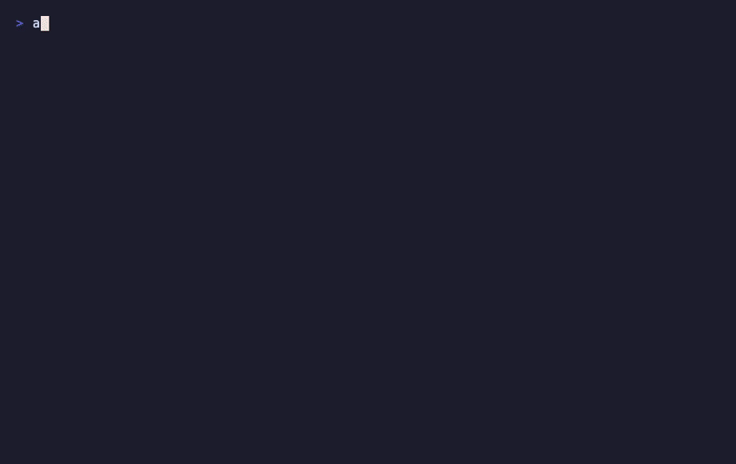

# Assay

**Signed evidence for tool-using AI.**

Microsoft enforces runtime policy. Assay proves what happened.



One byte changed. Verification fails. No server call. Just math.

### Install

```bash
pipx install assay-ai
```

To update later: `pipx upgrade assay-ai`

_(No pipx? `python3 -m pip install assay-ai` also works, or `brew install pipx && pipx install assay-ai`)_

### Start here

**Best first run:**

```bash
assay demo-challenge
```

**Or choose another path:**

- **[Verify a proof pack in your browser](https://haserjian.github.io/assay-proof-gallery/verify.html)** — no install, no account
- **MCP demo:** `assay try-mcp` — MCP tool calls with signed receipts (30 seconds)
- **[See the before/after specimen](https://github.com/Haserjian/assay-proof-gallery/tree/main/gallery/07-contested-decision)** — contested decision, reconstruction vs verification

Assay turns AI runs into signed proof packs another team can verify offline. It makes tampering visible and preserves honest failure.

---

### Exit codes

| Exit | State | Meaning |
|------|-------|---------|
| `0` | **pass** | Authentic evidence, standards met |
| `1` | **honest fail** | Authentic evidence, standards not met |
| `2` | **tampered** | Evidence altered after signing |

A signed failure is stronger evidence than a vague pass.

### Why it matters

- **Tamper detection** — every byte of evidence is fingerprinted and signed; post-run edits are visible
- **Honest failure retention** — a failed run stays failed; evidence cannot be quietly upgraded to a pass
- **Offline verification** — another team verifies without calling your server or trusting your logs

### What a proof pack contains

```
proof_pack/
  receipt_pack.jsonl      # One receipt per tool call, model invocation, or policy check
  pack_manifest.json      # SHA-256 hashes of every file + Ed25519 signature
  pack_signature.sig      # Raw signature bytes
  verify_report.json      # Machine-readable verification result
  verify_transcript.md    # Human-readable transcript
```

Change one byte in any file. Verification fails.

### Try more

```bash
assay try                  # General proof pack demo (15 seconds)
assay demo-challenge       # Good pack + tampered pack side by side
assay start                # Guided setup for your project
```

### Golden path

```bash
assay scan . --report      # Find uninstrumented LLM call sites
assay patch .              # Auto-insert SDK integration
assay run -- python my.py  # Run + build signed proof pack
assay verify-pack ./proof_pack_*/   # Verify offline
```

> **Boundary:** Assay proves the evidence artifact has not been altered
> after signing. It does not prove the signer was an authorized signer for
> this evidence — at T0, structural cryptographic validity is confirmed, not
> signer authority. Stronger signer-trust guarantees require a higher trust
> tier with externally controlled keys and/or external anchors.
> It does not prove every upstream input was authentic.
> [Trust tiers](docs/FULL_PICTURE.md#trust-tiers) · [What Assay does today](docs/WHAT_ASSAY_DOES_TODAY.md).

---

<details>
<summary><b>Why this exists</b></summary>

We scanned **30 AI projects** and found **231** high-confidence LLM call sites.
None had Assay-compatible tamper-evident instrumentation.
(Many have logging — this measures cryptographic evidence specifically.)
[Full results](scripts/scan_study/results/report.md).

**Adversarial testing:** 16 deterministic tampering attacks, all caught,
zero false passes. [Full report](docs/TRUST_UNDER_ATTACK.md).

> **Self-scan note:** Running `assay score .` on this repo returns a low
> score. That is expected — Assay instruments AI workflows, not itself.
> This repo is the instrument, not the subject.

**Why now:** EU AI Act Article 12 requires automatic logging for high-risk
AI systems; Article 19 requires providers to retain automatically generated
logs for at least 6 months. High-risk obligations apply from 2 Aug 2026
(Annex III) and 2 Aug 2027 (regulated products). SOC 2 CC7.2 requires
monitoring of system components and analysis of anomalies as security events.
"We have logs on our server" is not independently verifiable evidence.
Assay produces evidence that is.
See [compliance citations](docs/compliance-citations.md) for exact references.

For the ecosystem map, see [docs/REPO_MAP.md](docs/REPO_MAP.md).

</details>

<details>
<summary><b>See it — then understand it</b> (demo-challenge, demo-incident, honest failure)</summary>

## See It -- Then Understand It

`assay try` (above) gives you the 15-second version. For the full specimen
with file output and manual verification, use the challenge demo:

```bash
assay demo-challenge    # creates challenge_pack/ with good + tampered packs
```

Two packs, one byte changed ("gpt-4" -> "gpt-5" in the receipts). Here's what happens
(pack IDs and timestamps will differ on your machine):

```
$ assay verify-pack challenge_pack/good/

  VERIFICATION PASSED

  Pack ID:    pack_20260222_ca2bb665
  Integrity:  PASS
  Claims:     PASS
  Receipts:   3
  Signature:  Ed25519 valid

  Exit code: 0

$ assay verify-pack challenge_pack/tampered/

  VERIFICATION FAILED

  Pack ID:    pack_20260222_ca2bb665
  Integrity:  FAIL
  Error:      Hash mismatch for receipt_pack.jsonl

  Exit code: 2
```

One byte changed. Verification fails. No server access needed. Verification is pure math — no accounts, no infrastructure.

Now try the policy violation demo:

```bash
assay demo-incident     # two-act scenario: honest PASS vs honest FAIL
```

```
  Act 1: Agent uses gpt-4 with guardian check
  Integrity: PASS    Claims: PASS    Exit code: 0

  Act 2: Someone swaps model to gpt-3.5-turbo, removes guardian
  Integrity: PASS    Claims: FAIL    Exit code: 1
```

Act 2 is an **honest failure** -- authentic evidence proving the run violated
its declared standards. The evidence is real. The failure is real. Nobody can
edit the history. Exit code 1.

**Honest failure is a feature, not an embarrassment.** Exit 1 is audit gold:
a control failed, the failure is detectable and retained, and the evidence is
authentic. A signed failure is stronger evidence than a vague pass. Auditors,
regulators, and buyers trust systems that can show what went wrong -- not
systems that only ever claim success.

### How that works

Assay separates two questions on purpose:

- **Integrity**: "Were these bytes tampered with after creation?" (signatures, hashes, required files)
- **Claims**: "Does this evidence satisfy our declared governance checks?" (receipt types, counts, field values)

| Integrity | Claims | Exit | Meaning |
|-----------|--------|------|---------|
| PASS | PASS | 0 | Evidence checks out, declared standards pass |
| PASS | FAIL | 1 | Honest failure: authentic evidence of a standards violation |
| FAIL | -- | 2 | Tampered evidence |
| -- | -- | 3 | Bad input (missing files, invalid arguments) |

The split is the point. Systems that can prove they failed honestly are
more trustworthy than systems that always claim to pass.

**With real calls:** `assay scan .` finds your actual OpenAI / Anthropic / Gemini / LiteLLM / LangChain call sites. `assay patch .` instruments them. Every real LLM call emits a signed receipt. The demos above use synthetic data so you can see verification without configuring anything.

### How Assay captures evidence

Installing Assay gives you the CLI, receipt store, and proof-pack builder.
It does **not** automatically record your app.

Receipts are emitted only when your runtime is instrumented:

- `assay patch .` inserts the right Assay integration for supported SDKs
- `patch()` wrappers emit receipts when model calls happen
- `AssayCallbackHandler()` does the same for LangChain callback flows
- `emit_receipt(...)` lets you record events manually in any stack

`assay run -- <your command>` then does three things:

1. creates a trace id
2. runs your app with `ASSAY_TRACE_ID` in the environment
3. packages any emitted receipts into `proof_pack_<trace_id>/`

The result is a signed, offline-verifiable artifact:

```text
app execution
  -> instrumented SDK or emit_receipt(...)
  -> receipts written to ~/.assay/...
  -> assay run packages them into proof_pack_<trace_id>/
  -> assay verify-pack checks the artifact offline
```

</details>

<details>
<summary><b>What becomes harder to fake</b></summary>

## What Becomes Harder to Fake

Assay is not a truth oracle. It is an evidence-hardening layer.

| If someone tries to... | Without Assay | With Assay |
|------------------------|---------------|------------|
| Edit evidence after a run | Hard to notice | Verification fails |
| Drop or weaken locked checks | Easy to hide | Lock mismatch exposes it |
| Omit covered call sites | Easy to hand-wave | Completeness checks catch it |
| Hand buyer internal logs, ask for trust | Buyer must trust the operator | Buyer verifies offline |
| Fabricate a complete run from scratch | Possible | Still possible at base tier; stronger deployment raises the cost |

**Why there is no quiet edit.** Every file in a proof pack is fingerprinted.
The fingerprints are recorded in a manifest. The manifest is digitally signed.
Change a file -- the fingerprint won't match. Fix the manifest to cover it --
the signature breaks. Re-sign the manifest -- the signer identity changes.
Every path to tampering leaves a visible trace.

**Assay proves the evidence artifact has not been quietly changed after the
fact. It does not, by itself, prove every upstream component was honest.**

**Deployment ladder -- start at Base, strengthen as your trust requirements grow:**

- **Base** -- self-signed artifact, offline-verifiable, tamper-evident
- **Hardened** -- CI-held signing key + branch protection (separates signer from developer)
- **Anchored** -- [transparency ledger](https://github.com/Haserjian/assay-ledger) + external timestamping (RFC 3161)

Completeness is enforced relative to call sites enumerated by the scanner
and/or declared by policy. Undetected call sites are a known residual risk,
reduced via multi-detector scanning and CI gating.

Assay doesn't make fraud impossible -- it makes fraud expensive, fragile,
and much easier to catch.

</details>

<details>
<summary><b>Three operating modes</b> (wrapper, runtime SDK, settlement)</summary>

## Three Operating Modes

Assay operates in three modes depending on your runtime shape.

### Mode 1: Wrapper

For scripts, CI jobs, and bounded workflows. Lowest friction.

```bash
assay run -c receipt_completeness -- python my_app.py
assay verify-pack ./proof_pack_*/
```

One process, one proof pack, one verification.

### Mode 2: Runtime

For services, agents, and long-lived processes. Emit receipts during execution, seal checkpoints at review boundaries.

```python
import assay

with assay.open_episode(policy_version="v2.1") as episode:
    episode.emit("model.invoked", {"model": "gpt-4", "tokens": 800})
    episode.emit("tool.invoked", {"tool": "knowledge_base"})
    checkpoint = episode.seal_checkpoint(reason="before_send_reply")
    verdict = assay.verify_checkpoint(checkpoint)
    # verdict.ok / verdict.honest_fail / verdict.tampered
```

The episode is the primary unit, not the Unix process. See [SDK docs](docs/START_HERE.md) for verdict handling.

### Mode 3: Settlement

For high-consequence actions. Evidence posture must verify before the world changes.

```python
checkpoint = episode.seal_checkpoint(reason="before_payout")
verdict = assay.verify_checkpoint(checkpoint)
if verdict.ok:
    execute_payout()
# If not ok: honest_fail → escalate; tampered → alert. Do not proceed.
```

`verify_checkpoint()` is the gate. See [Decision Escrow](docs/decision-escrow.md) for the protocol model.

</details>

<details>
<summary><b>Full project setup</b> (scan, patch, run, verify, CI gate)</summary>

## Full Project Setup

```bash
# 1. Find uninstrumented LLM calls
assay scan . --report

# 2. Patch (one line per SDK, or auto-patch all)
assay patch .

# 3. Run + build a signed evidence pack
# -c receipt_completeness runs the built-in completeness check (see `assay cards list` for all options)
# everything after -- is your normal run command
assay run -c receipt_completeness -- python my_app.py

# 4. Verify (CLI or browser — no install needed for browser)
assay verify-pack ./proof_pack_*/
# Or verify in your browser: https://haserjian.github.io/assay-proof-gallery/verify.html

# 5. Generate report artifacts for security/compliance review
assay report . -o evidence_report.html --sarif

# 6. Optional: set and enforce score gates in CI
assay gate save-baseline
assay gate check . --min-score 60 --fail-on-regression
```

> **Command discovery:** `assay --help` shows common entry points; `gate`, `report`, `ci`, `diff`, `analyze`, `lock`, and `vendorq` are available but unlisted by default. Run `assay <command> --help` for full options.

Scanner covers OpenAI, Anthropic, Gemini, LiteLLM, LangChain via AST — dynamic dispatch and raw HTTP are not. See [SCANNER_LIMITATIONS.md](docs/SCANNER_LIMITATIONS.md).

**Local models**: Any OpenAI-compatible server (Ollama, LM Studio, vLLM,
llama.cpp) works automatically -- Assay patches the OpenAI SDK at the class
level, so `OpenAI(base_url="http://localhost:11434/v1")` emits receipts like
any other provider. LiteLLM users get the same coverage via the LiteLLM
integration (`ollama/llama3`, etc.).

## CI Gate

Fastest path (recommended):

```bash
assay ci init github --run-command "python my_app.py" --min-score 60
```

This generates a 3-job GitHub Actions workflow:
- `assay-gate` (score enforcement, regression checks, JSON gate report artifact)
- `assay-verify` (proof pack generation + cryptographic verification)
- `assay-report` (HTML evidence report artifact + SARIF upload)

For the manual path (lockfile, gate flags, daily diff/analyze), see [Start Here](docs/START_HERE.md).

</details>

<details>
<summary><b>Evidence compiler model</b></summary>

## The Evidence Compiler

Assay is an **evidence compiler** for AI execution. If you've used a build
system, you already know the mental model:

| Concept | Build System | Assay |
|---------|-------------|-------|
| Source | `.c` / `.ts` files | Receipts (one per LLM call) |
| Artifact | Binary / bundle | Evidence pack (5 files, 1 signature) |
| Tests | Unit / integration tests | Verification (integrity + claims) |
| Lock | `package-lock.json` | `assay.lock` |
| Gate | CI deploy check | CI evidence gate |

</details>

<details>
<summary><b>Full command reference</b></summary>

## Commands

The core path is 6 commands:

```
assay try                 # 60-second demo (sign, tamper, catch)
assay scan / assay patch  # instrument
assay run                 # produce evidence
assay verify-pack         # verify evidence
assay diff                # catch regressions
assay score               # evidence readiness (0-100, A-F)
```

**Getting started**

| Command | Purpose |
|---------|---------|
| `assay try` | 60-second demo: sign, tamper, catch |
| `assay status` | One-screen operational dashboard |
| `assay start demo\|ci\|mcp` | Guided entrypoints for trying, CI setup, or MCP auditing |
| `assay onboard` | Guided setup: doctor -> scan -> first run plan |
| `assay doctor` | Preflight check: is Assay ready here? |

**Instrument + produce evidence**

| Command | Purpose |
|---------|---------|
| `assay scan` | Find uninstrumented LLM call sites (`--report` for HTML) |
| `assay patch` | Auto-insert SDK integration patches into your entrypoint |
| `assay run` | Wrap command, collect receipts, build signed evidence pack |

**Verify + analyze**

| Command | Purpose |
|---------|---------|
| `assay verify-pack` | Verify integrity + claims (the 4 exit codes) |
| `assay explain` | Plain-English summary of an evidence pack |
| `assay analyze` | Cost, latency, error breakdown from pack or `--history` |
| `assay diff` | Compare packs: claims, cost, latency (`--against-previous`, `--why`) |
| `assay score` | Evidence Readiness Score (0-100, A-F) with anti-gaming caps |

**CI**

| Command | Purpose |
|---------|---------|
| `assay ci init github` | Generate a GitHub Actions workflow |
| `assay flow try\|adopt\|ci\|mcp\|audit` | Guided workflow executor (`--apply` to execute) |

**MCP + policy**

| Command | Purpose |
|---------|---------|
| `assay mcp-proxy` | Transparent MCP proxy: intercept tool calls, emit receipts |
| `assay mcp policy init` | Generate a starter MCP policy YAML file |
| `assay mcp policy validate` | Validate a policy file against the schema |
| `assay policy impact` | Analyze policy impact on existing evidence |

Full reference (key management, lockfile, pack management, incident forensics): [docs/README_quickstart.md](docs/README_quickstart.md)

</details>

<details>
<summary><b>Advanced: VendorQ</b> (verifiable vendor questionnaires)</summary>

## VendorQ: Verifiable Vendor Questionnaires

Enterprise customers ask AI governance questions in security questionnaires.
VendorQ compiles evidence-backed answer packets from Assay proof packs.
Every answer traces to a signed receipt. Every modification is detectable.

For the buyer-facing wrapper around that proof material, see [docs/reviewer-packets.md](docs/reviewer-packets.md).

Quick path:

```bash
assay vendorq ingest --in questionnaire.csv --out .assay/vendorq/questions.json
assay vendorq compile --questions .assay/vendorq/questions.json --pack ./proof_pack_* --policy conservative --out .assay/vendorq/answers.json
assay vendorq export-reviewer --proof-pack ./proof_pack_* --out reviewer_packet
assay reviewer verify reviewer_packet
assay reviewer census reviewer_packet
```

Use VendorQ when the pain is: "we have to answer AI-governance questions and we cannot hand the reviewer a verifiable artifact."

```bash
# Ingest a questionnaire, compile answers against evidence, lock, verify
assay vendorq ingest --in questionnaire.csv --out questions.json
assay vendorq compile --questions questions.json --pack ./proof_pack --out answers.json
assay vendorq lock write --answers answers.json --pack ./proof_pack --out vendorq.lock
assay vendorq verify --answers answers.json --pack ./proof_pack --lock vendorq.lock --strict
```

10 deterministic verification rules. Tamper one answer and verification
fails with exit code 2. The packet is forwardable to your customer's
security team — they verify it offline with a public key.

**See it live**: [Proof Gallery](https://haserjian.github.io/assay-proof-gallery/) —
three real proof packs demonstrating pass, honest fail, and tamper detection.
All three are independently verifiable without any account or API key.

**Adversarial testing**: [16 attack scenarios, 16 catches, 0 false passes](docs/TRUST_UNDER_ATTACK.md).

</details>

<details>
<summary><b>Advanced: Reviewer packets</b> (cross-boundary evidence handoff)</summary>

## Reviewer-Ready Evidence Packets

A reviewer-ready evidence packet is the buyer-facing wrapper around a signed proof pack.
Assay produces the proof pack. The evidence packet makes that proof usable
across an organizational boundary: scope, coverage, review state, and the
nested proof-pack verification path in one forwardable artifact.

```bash
# Compile a reviewer packet from a proof pack plus declarative packet inputs
assay vendorq export-reviewer \
  --proof-pack tests/fixtures/reviewer_packet/sample_proof_pack \
  --boundary tests/fixtures/reviewer_packet/sample_boundary.json \
  --mapping tests/fixtures/reviewer_packet/sample_mapping.json \
  --out reviewer_packet_demo

# Verify the reviewer packet and derive the settlement
assay reviewer verify reviewer_packet_demo
assay reviewer verify reviewer_packet_demo --json

# Generate a Decision Census report from the compiled reviewer packet
assay reviewer census reviewer_packet_demo
assay reviewer census reviewer_packet_demo --json
```

Canonical handoff flow:

```text
proof pack -> reviewer packet -> assay reviewer verify -> browser verify
```

Buyer verdicts and CLI exit codes are different layers:

- **Buyer verdicts**: VERIFIED, VERIFIED_WITH_GAPS, INCOMPLETE_EVIDENCE, EVIDENCE_REGRESSION, TAMPERED, OUT_OF_SCOPE
- **CLI exit codes**: 0/1/2/3 for PASS, HONEST_FAIL, TAMPERED, and bad input

Use the proof pack when you need cryptographic verification. Use the
evidence packet when another team needs a bounded artifact they can inspect,
forward, and challenge.

**Verify online**: [Browser verifier](https://haserjian.github.io/assay-proof-gallery/verify.html) —
drop in a proof pack or reviewer packet and check it client-side.

</details>

<details>
<summary><b>Advanced: Passports</b> (portable signed evidence credentials)</summary>

## Passports: Portable Signed Evidence

A passport is a signed, content-addressed JSON object that summarizes what
was verified about an AI system: claims, coverage, reliance class, and a
validity window. Built from proof pack evidence, not asserted by hand.

Try the seeded lifecycle demo (no API key, no repo context needed):

```bash
pip install assay-ai
assay passport demo
```

The demo intentionally starts with a weak passport, then challenges and
supersedes it. The initial X-Ray grade (D) is part of the lifecycle, not
a product failure.

**12 commands** (`assay passport --help`). The 6 you'll use most:

| Command | Question |
|---------|----------|
| `verify` | Is this artifact authentic and untampered? |
| `status` | Should I rely on it under my policy? (PASS/WARN/FAIL) |
| `xray` | How strong is the evidence posture? (A-F grade) |
| `challenge` | Record a governance objection against a passport |
| `supersede` | Link the old passport to an improved successor |
| `diff` | What changed between two passport versions? |

Also: `mint`, `sign`, `show`, `render`, `revoke`, `demo`.

Full command set:

```bash
# Mint a passport from a proof pack, sign it, verify it
assay passport mint --pack ./proof_pack/ --subject-name "MyApp" \
  --system-id "my.app.v1" --owner "My Org" --output passport.json
assay passport sign passport.json
assay passport verify passport.json

# Check reliance posture under a policy mode
assay passport status passport.json --mode buyer-safe --json

# X-Ray diagnostic: structural grade (A-F) and improvement path
assay passport xray passport.json --report xray.html

# Lifecycle governance (all cryptographically signed)
assay passport challenge passport.json --reason "Missing coverage"
assay passport supersede old.json new.json --reason "Addressed gap"
assay passport diff old.json new.json --report diff.html
```

**Worked example**: [Seeded referee gallery](docs/passport/gallery/) —
pre-built signed passports, governance receipts, X-Ray diagnostic, and
trust diff. All artifacts are regenerable via
`python3 docs/passport/generate_gallery.py`.

**Deeper docs**: [Passport guide](docs/passport/README.md) |
[Verification ritual](docs/passport/VERIFICATION.md) |
[Gallery manifest](docs/passport/gallery/GALLERY.md)

**What this proves today:**
- Signed, content-addressed passport artifacts with Ed25519 signatures
- Deterministic lifecycle governance: challenge, supersede, revoke, diff
- Reproducible worked examples on seeded reference artifacts
- Offline verification without network access

**What is future scope:**
- Arbitrary external trust-surface scanning (URLs, PDFs, vendor pages)
- Minting from external vendor documents (currently proof-pack only)
- Generalized trust analysis across messy real-world inputs
- Enterprise diff workflows (primitive exists, product does not)

</details>

<details>
<summary><b>Advanced: AI Decision Credentials (ADC)</b></summary>

## AI Decision Credentials (ADC)

ADC is a structured schema for packaging AI decision evidence into
verifiable, time-bounded credentials. An ADC wraps the proof pack with
decision metadata: what was decided, by whom, under what policy, with
what evidence, and how long the credential remains valid.

```bash
# Verify a pack with expiry enforcement
assay verify-pack ./proof_pack_*/ --check-expiry

# ADC v0.1 schema: 35 properties, 17 required, additionalProperties: false
# Schema: src/assay/schemas/adc_v0.1.schema.json
```

The conformance corpus includes 10 canonical packs (including `stale_01`
for expired credentials and `superseded_01` for replaced decisions).

</details>

<details>
<summary>Install details (Windows, PATH issues, deterministic setup)</summary>

```powershell
# Windows
py -m pip install assay-ai
```

Assay requires Python 3.9+.

If `pip` is not on your PATH, use `python3 -m pip` on macOS/Linux or
`py -m pip` on Windows.

Validation status:

- CI smoke-tests the first CLI path on Linux, macOS, and Windows using
  `assay version` and `assay try`.
- The deeper SDK compatibility suite currently runs on Ubuntu.

If `assay` is not recognized after install, open a new terminal first. On
Windows, the usual fix is adding Python's `Scripts` directory to PATH.

For deterministic environment setup, see [docs/START_HERE.md](docs/START_HERE.md).

**Shell completions (bash/zsh/fish/PowerShell):**

```bash
assay --install-completion
```

Restart your shell after installing. Tab completion works for all commands and options.

</details>

---

## Who this is for

- **Developers** — scan existing code, instrument LLM calls, get a signed artifact per run
- **Security and CI teams** — gate on evidence quality, fail builds without tamper-evident proof packs
- **MCP and agent operators** — `assay try-mcp`, transparent MCP proxy, per-tool-call receipts
- **Auditors, compliance teams, and reviewers** — offline verification, reviewer packets, HTML evidence reports

## Documentation

- **[Start Here](docs/START_HERE.md) -- 6 steps from install to evidence in CI**
- [Evidence Packets](docs/reviewer-packets.md) -- compile, verify, and hand off reviewer-ready evidence packets
- [What Assay Does Today](docs/WHAT_ASSAY_DOES_TODAY.md) -- the plain-language founder memo
- [Boundary Map](docs/BOUNDARY_MAP.md) -- Assay vs VendorQ vs AgentMesh vs Loom/CCIO
- [Full Picture](docs/FULL_PICTURE.md) -- architecture, trust tiers, repo boundaries, release history
- [Quickstart](docs/README_quickstart.md) -- install, golden path, command reference
- [For Compliance Teams](docs/for-compliance.md) -- what auditors see, evidence artifacts, framework alignment
- [Compliance Citations](docs/compliance-citations.md) -- exact regulatory references (EU AI Act, SOC 2, ISO 42001)
- [Decision Escrow](docs/decision-escrow.md) -- protocol model: agent actions don't settle until verified
- [Roadmap](docs/ROADMAP.md) -- phases, product boundary, execution stack
- [Repo Map](docs/REPO_MAP.md) -- what lives where across the Assay ecosystem
- [Pilot Program](docs/PILOT_PROGRAM.md) -- early adopter program details

## Common Issues

- **"No receipts emitted" after `assay run`**: First, check whether your code
  has call sites: `assay scan .` -- if scan finds 0 sites, you may not be
  using a supported SDK yet. Installing Assay alone does not emit receipts;
  your runtime must be instrumented. If scan finds sites, check:
  (1) Is `# assay:patched` in the file, or did you add `patch()` / a callback?
  Run `assay scan . --report` to see patch status per file.
  (2) Did you install the SDK extra (`python3 -m pip install "assay-ai[openai]"`)?
  (3) Did `patch()` execute before the first model call?
  (4) Did you use `--` before your command (`assay run -- python app.py`)?
  Run `assay doctor` for a full diagnostic.

- **LangChain projects**: `assay patch` auto-instruments OpenAI and Anthropic
  SDKs but not LangChain (which uses callbacks, not monkey-patching). For
  LangChain, add `AssayCallbackHandler()` to your chain's `callbacks` parameter
  manually. See `src/assay/integrations/langchain.py` for the handler.

- **`assay run python app.py` gives "No command provided"**: You need the `--`
  separator: `assay run -c receipt_completeness -- python app.py`. Everything
  after `--` is passed to the subprocess.

- **Quickstart blocked on large directories**: `assay quickstart` guards against
  scanning system directories (>10K Python files). Use `--force` to bypass:
  `assay quickstart --force`.

- **macOS: `ModuleNotFoundError` inside `assay run` but works outside it**:
  On macOS, `python3` on PATH may point to a different Python version than
  where assay and your SDK are installed (e.g. `python3` → 3.14, but packages
  are in 3.11). Use a virtual environment (recommended), or specify the exact
  interpreter: `assay run -- python3.11 app.py`. Check with
  `python3 --version` and compare to the Python where you installed Assay.

## Get Involved

- **Try it**: `python3 -m pip install assay-ai && assay try`
- **Questions / feedback**: [GitHub Discussions](https://github.com/Haserjian/assay/discussions)
- **Bug reports**: [Issues](https://github.com/Haserjian/assay/issues)
- **Want this in your stack in 2 weeks?** [Pilot program](docs/PILOT_PROGRAM.md) --
  we instrument your AI workflows, set up CI gates, and hand you a working
  evidence pipeline. [Open a pilot inquiry](https://github.com/Haserjian/assay/issues/new?template=pilot-inquiry.md).

## Related Repos

| Repo | Purpose |
|------|---------|
| [assay](https://github.com/Haserjian/assay) | Core CLI, SDK, conformance corpus (this repo) |
| [assay-verify-action](https://github.com/Haserjian/assay-verify-action) | GitHub Action for CI verification |
| [assay-ledger](https://github.com/Haserjian/assay-ledger) | Public transparency ledger |
| [assay-proof-gallery](https://github.com/Haserjian/assay-proof-gallery) | Live demo packs (PASS / HONEST FAIL / TAMPERED) |

## License

Apache-2.0
